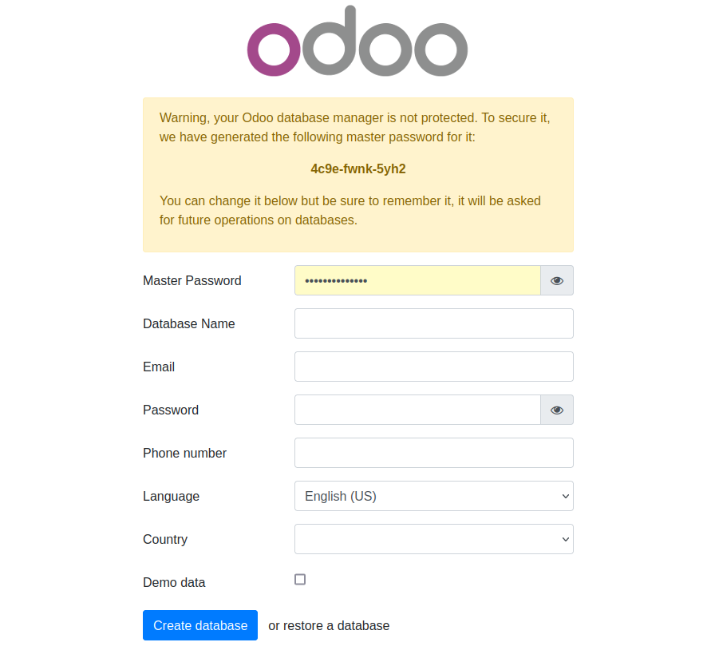

# Odoodock

Odoodock es un entorno de desarrollo de Odoo para Docker que sigue la idea propuesta por laradock. 

## Características

- Creación de imagen personalizada con la instalación de varias herramientas de apoyo.
- Soporte para _odoo_, _odoo shell_ y _scaffolding_
- Soporte de varios servicios de apoyo:
  - Moodle
  - MariaDB (para Moodle)
- Cada servicio corre en un propio contenedor.
- Scripts para la generación automática de módulos por _scaffolding_, clonado de repositorios _git_, descompresión de paquetes
- Permite el desarrollo desde dentro del contenedor de Odoo.
- Configuración de serie para realizar depuración en Visual Studio Code
- Fácilmente configurable a través de variables de entorno.
- Pensado con fines académicos: código muy comentado
- Soporte para Odoo versión 14

## Cómo empezar

### Requisitos

- [git](https://git-scm.com/downloads)
- [Visual Studio Code](https://code.visualstudio.com/)
- [Docker]
   - Opción 1: [Docker Engine](https://docs.docker.com/engine/) >= 23.0.0 con [Docker Compose plugin](https://docs.docker.com/compose/) >= 2.17.0
   - Opción 2: [Docker Desktop](https://docs.docker.com/desktop/)


### Instalación

1. Crear la carpeta que contendrá todo lo necesario para el desarrollo los módulos de Odoo, por ejemplo _odoo_dev_

   ```
   mkdir odoo_dev
   ```

   > Nota: ten en cuenta que esta carpeta define un servidor de Odoo, en el que puede haber varios módulos en desarrollo.


2. Clonar en su interior _odoodock_

   ```
   cd odoo_dev
   git clone git@github.com:aoltra/odoodock.git
   ```

3. Entrar en la carpeta odoodock

   ```
   cd odoodock
   ```

4. Copiar el fichero _env-example_ a _.env_

   ```
   cp env-example .env
   ```

4. Modificar el fichero _.env_ para adapartalo a nuestras necesidades   

5. Copiar el fichero _services-example_ a _.services_

   ```
   cp services-example .services
   ```

6. Modificar el fichero _.services_ para incluir los servicios que deseamos arrancar. Los servicios se separan por espacios y van entrecomillados. 

   > El servicio _web_ es obligatorio para arrancar _odoo_

7. Asignar permisos de ejecución para el usuario al fichero _up.sh_ y _create-modules.sh_

   ```
   chmod u+x ./up.sh
   chmod u+x ./create-modules.sh
   ```

8. Arrancar los servicios

   ```
   ./up.sh
   ```

9. Para comprobar que todo ha ido correctamente, acceder desde un navegador a _localhost:8069_, donde debe aparecer la página del selector de la base de datos.

<center>



</center>

10. Configurar los valores y crear la base de datos

   > Es recomendable almacenar el _master password_ en un fichero aparte

11. Si todo ha ido correctamente, una vez finalizada la creación de la base de datos, deberá cargarse en el navegador la página _Aplicaciones_


### Creando módulos

#### O1. Crear un módulo con _odoo scaffold_

   Ejecutar el script _create-module.sh_ con la opción _-s_. Por ejemplo, desde la carpeta _odoodock_
     
   ```
   ./create-module.sh -s mimodulo
   ```

#### O2. Clonar un módulo desde un repo existente

   Ejecutar el script _create-module.sh_ con la opción _-g_. Por ejemplo, desde la carpeta _odoodock_
     
   ```
   ./create-module.sh -g https://github.com/user/mimodulo.git
   ```

   > Si el repo es público y todavía no se ha configurado el acceso por _ssh_, lo más rápido es utilizar _https_. Si el acceso se quiere realizar por ssh será necesario configurarlo. Más información en [Configuración git/ssh](#configuración-gitssh)

#### O3. Crear un módulo a partir de un fichero zip

   Ejecutar el script _create-module.sh_ con la opción _-z_. Por ejemplo, desde la carpeta _odoodock_
     
   ```
   ./create-module.sh -z ~/downloads/mimodulo.zip
   ```

   > Para el funcionamiento correcto de esta opción es necesario que en el host esté instalado _unzip_


> En cualquier caso siempre es posible entrar dentro del contendor _odoodck-web-1_ y ejecutar los comandos necesarios. Por ejemplo: 
>   ```
>   $ docker exec -it odoodock_web_1 bash
>   > odoo scaffold [nombre_del_modulo] /mnt/extra-addons
>   ```
>   o 
>
>   ```
>   $ docker exec -it odoodock_web_1 bash
>   > git clone [url_repo]
>   ```
> En estos casos es hay que tener en en cuenta que es posible que el contenedor pare su ejecución ya que el proceso que se ejecuta es interrumpido. Al cabo de unos segundos debería volver a reiniciarse de manera automática, aunque siempre es posible forzar el reinicio con _docker compose up -d web_

### Configuración git/ssh

Tanto la instalación de _git_ como la de _ssh_ se configuran desde fichero _.env_ (por defecto se realizan ambas). 

En general, la forma más sencilla de trabajar con un remoto es mediante _ssh_. Para ello, es necesario que en el _home_ del contenedor (en este caso _/var/lib/home_) se almacene la clave privada del usuario y que se tenga permisos sobre ella:

```
> docker cp ~/.ssh/id_rsa odoodock-web-1:/var/lib/odoo/.ssh
> docker run --rm --entrypoint /bin/bash -v odoodock_odoo_data:/var/lib/odoo odoodock_web -c "chown odoo:odoo /var/lib/odoo/.ssh/id_rsa"
```
donde _id_rsa_ es el fichero que contiene la clave privada del usuario.

## Licencia

Odoodock se distribuye bajo licencia GPL 3. Más información en [LICENSE](LICENSE)