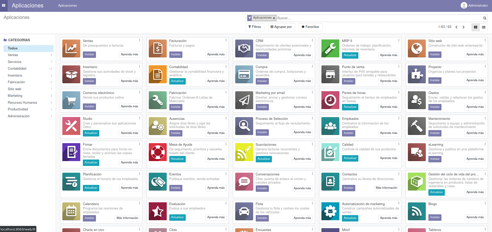

## Instalación

> A lo largo del documento, el prompt **$** indica un comando a introducir en el host, mientras que el prompt **>** indica un comando a introducir en el contenedor.

1. Crear la carpeta que contendrá todo lo necesario para el desarrollo los módulos de _Odoo_, por ejemplo _odoo_dev_

   ```
   $ mkdir odoo_dev
   ```

   > Hay que tener en cuenta que esta carpeta define un servidor de Odoo, en el que puede haber varios módulos en desarrollo.

2. Clonar en su interior _odoodock_

   ```
   $ cd odoo_dev
   $ git clone https://github.com/aoltra/odoodock.git
   ```

3. Entrar en la carpeta _odoodock_

   ```
   $ cd odoodock
   ```

4. Copiar el fichero _.env-example_ a _.env_

   ```
   $ cp .env-example .env
   ```

5. Modificar el fichero _.env_ para adapartalo a nuestras necesidades   

6. Copiar el fichero _.services-example_ a _.services_

   ```
   $ cp .services-example .services
   ```

7. Modificar el fichero _.services_ para incluir los servicios que deseamos arrancar. Los servicios se separan por espacios y van entrecomillados. 

   > El servicio _web_ es obligatorio para arrancar _odoo_

8. Asignar permisos de ejecución para el usuario al fichero _up.sh_ y _create-module.sh_

   ```
   $ chmod u+x ./up.sh
   $ chmod u+x ./create-module.sh
   ```

   > En sistemas WSL con Windows 10 es posible que el comando _chmod_ no funcione. Una posible solución consiste en  modificar el fichero _/etc/wsl.conf_ (es necesario _sudo_) e insertar:
   > ```
   > [automount]
   > options = "metadata"
   > ```
   > Es necesario reiniciar WSL.

9. Arrancar los servicios

   ```
   $ ./up.sh
   ```

10. Para comprobar que todo ha ido correctamente, acceder desde un navegador a _localhost:8069_, donde debe aparecer la página del selector de la base de datos.

     
   
11. Configurar los valores y crear la base de datos

    > Es recomendable almacenar el _master password_ en un fichero aparte

12. Si todo ha ido correctamente, una vez finalizada la creación de la base de datos, deberá cargarse en el navegador la página _Aplicaciones_

    